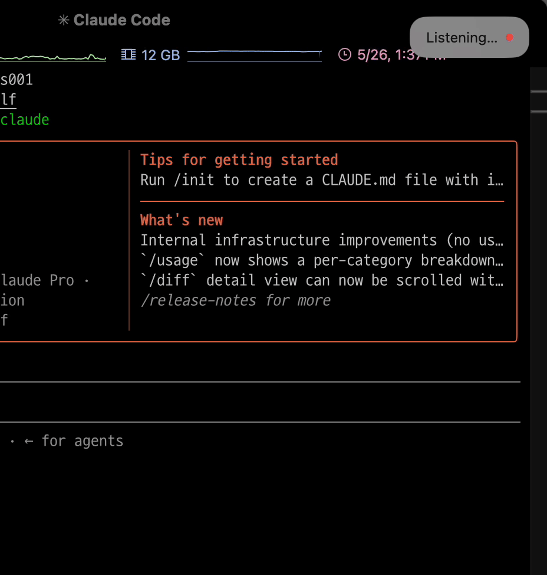
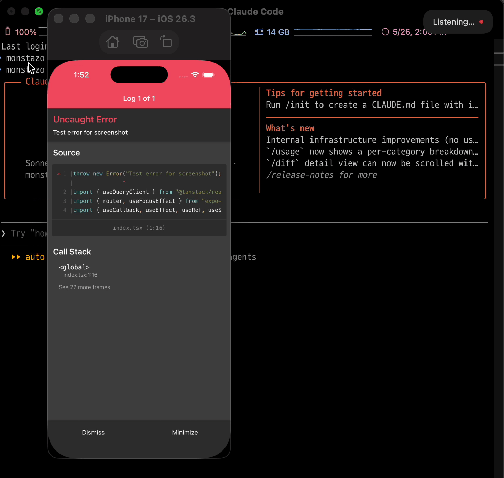
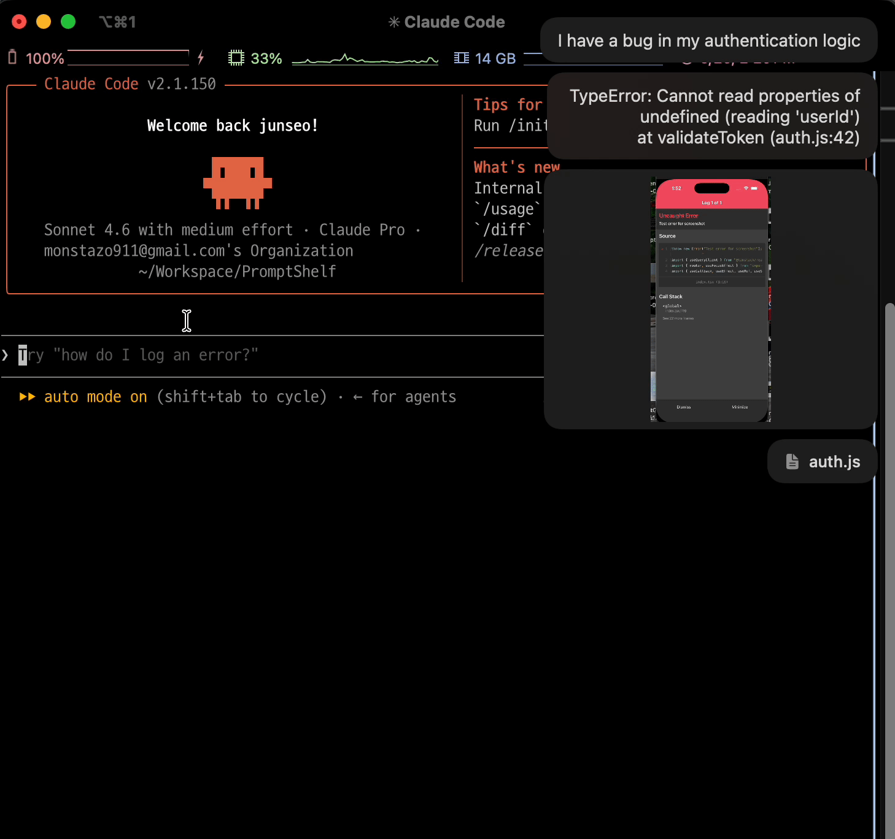

# PromptShelf

**A macOS menu bar app that stacks voice, screenshots, copied text, and files into one seamless AI prompt — then pastes everything in order with a single ⌘V.**

Works with Claude Code, Claude.ai, ChatGPT, Gemini, Cursor, Windsurf, Zed — anywhere you can type. No integrations. No plugins. No API keys.


---


---

## Features

**🎤 Voice Input** — Speak naturally. Your words are transcribed in real-time and stacked as a prompt chunk.

**📋 Clipboard Capture** — Any text or image you copy during a session is automatically added. No extra steps.

**📸 Screenshot** — `⌘⇧3` / `⌘⇧4` during a session captures directly to your shelf — no file saved to desktop.

**📁 File Drop** — Drag files onto the panel. Pasted as a file URL for web AI tools, or path text for terminals.

**⚡ Smart Paste** — `⌘V` sends everything to your AI in order — voice, images, files, all at once.

**🌍 Multi-language** — 63 speech recognition languages. Add the ones you need from the menu.

---

## Demo

| 🎤 Voice Input | 📋 Clipboard Capture |
|:--------------:|:--------------------:|
|  |  |
| `⌃` + `⌥` to start speaking | `⌘` + `C` anything during session |

| 🖼️ Image Copy | 📸 Screenshot |
|:-------------:|:-------------:|
|  |  |
| `⌘` + `C` on any image | `⌘` + `⇧` + `3` / `⌘` + `⇧` + `4` during session |

| 📁 File Drop | ⚡ Smart Paste |
|:-----------:|:-------------:|
|  |  |
| Drag & drop onto panel | `⌘` + `V` to send everything in order |

---

## Install

### Download (Recommended)
Download the latest `.dmg` from [Releases](https://github.com/monsta-zo/PromptShelf/releases).

### Build from Source
```bash
git clone https://github.com/monsta-zo/PromptShelf.git
cd PromptShelf
bash build-app.sh
cp -r PromptShelf.app /Applications/
open /Applications/PromptShelf.app
```

> Requires Xcode Command Line Tools: `xcode-select --install`

---

## Permissions

PromptShelf requires the following on first launch:

| Permission | Why |
|-----------|-----|
| **Microphone** | Voice-to-text transcription |
| **Speech Recognition** | Converting speech to prompt text |
| **Accessibility** | Detecting ⌘V to trigger sequential paste |

---

## Shortcuts

| Shortcut | Action |
|----------|--------|
| `⌃⌥` | Toggle session (start / cancel) |
| `⌘C` | Auto-captured during session |
| `⌘⇧3` / `⌘⇧4` | Screenshot directly to shelf |
| `⌘V` | Paste all chunks in order |

---

## Requirements

- macOS 15 or later
- Apple Silicon or Intel Mac

---

## Contributing

PRs are welcome. For major changes, open an issue first.

```bash
git clone https://github.com/monsta-zo/PromptShelf.git
cd PromptShelf
swift build
```

---

## License

[MIT](LICENSE)
